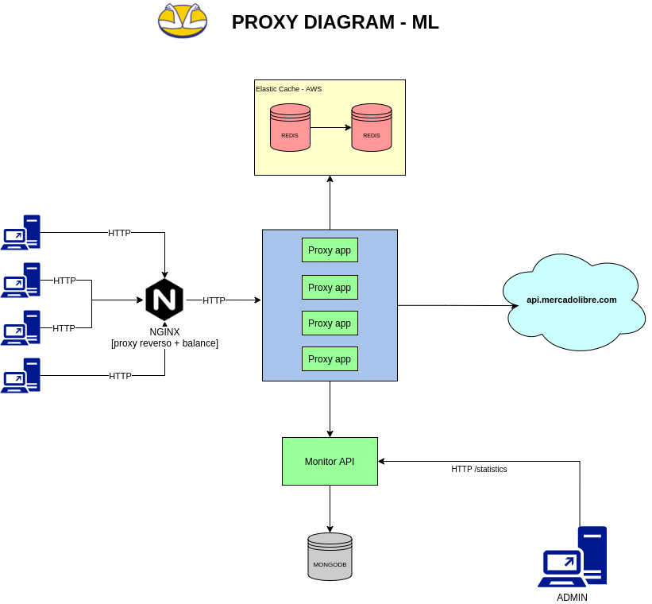
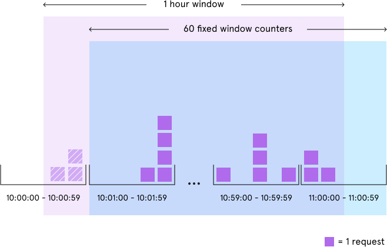
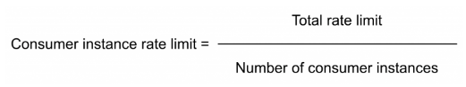

# ML Proxy

Proxy developed for the Mercado Livre technical challenge.
On each folder you'll find the source code for every component developed for the challenge.

## Getting Started

These instructions will get you a copy of the project up and running on your local machine for development and testing purposes.

### Prerequisites

https://www.docker.com/get-started

## Using the Proxy

Run in the command line:
```
git clone git@github.com:rafaduka/ml-proxy.git
cd ml-proxy
docker-compose up --build
```

Test the proxy, run in the command line:
```
curl http://localhost:8080/categories/MLA5725
```

## Statistics

#### To view statistics, go to curl in the terminal

Run in the command line:
```
curl -L -X GET 'http://localhost:8081/statistics'
```
Eg. Statistics are updated every 60 seconds, the endpoint "/statistics" 
groups all successes, errors, and requests that were blocked


#### To reset all stats, go to curl in the terminal

Run in the command line:
```
curl -L -X DELETE 'http://localhost:8081/statistics'
```

#### To register a metric in the statistics for testing, it is possible through curl below

Run in the command line:
```
curl -L -X POST 'http://localhost:8081/statistics' \
-H 'Content-Type: application/json' \
--data-raw '{
    "date":"123",
    "success":1,
    "fail":2,
    "limited":3,
    "duration":256,
    "total":7
}'
```

### Tests local with (Intellij) usually for debugging

(It is necessary to have MongoDB and Redis running) Execution can be performed with the code below

Run in the command line:
```
docker run --name mongo --rm -p 27017:27017 mongo:3.2.4
docker run --name redis --rm -p 6379:6379 redis:alpine -> docker exec -it redis /bin/bash
```

Run in the command line:
```
mvn spring-boot:run -Dspring.profiles.active="local"
mvn spring-boot:run -Dspring.profiles.active="docker"
```

## Solution diagram




### Rate Limit Window Algorithm
We count requests from each sender using multiple fixed time windows 1/60th the size of our rate limit’s time window.

For example, if we have an hourly rate limit, we increment counters specific to the current Unix minute timestamp and 
calculate the sum of all counters in the past hour when we receive a new request.



### Strategy Rate Limit Distributed

We divide the limit load for each instance according to the total available.
With the formula below




## Built With

* [Spring Boot](https://spring.io/) - The backend framework used
* [Maven](https://maven.apache.org/) - Dependency Management
* [Zuul](https://github.com/Netflix/zuul) - Gateway service
* [Mongo](https://www.mongodb.com/) - MongoDB

## Roadmap
- [x] Dockerizado
- [x] RateLimiter Proxy
- [x] API Statistics
- [ ] Swagger
- [ ] Load test over the proxy
- [x] Readme 

## Author

Rafael Horácio :octocat:  
rafaduka@gmail.com

## License
[MIT](https://choosealicense.com/licenses/mit/)